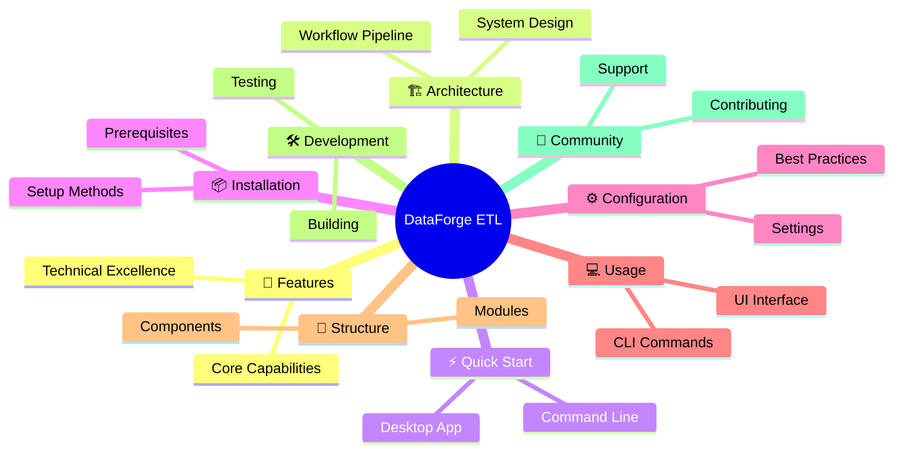
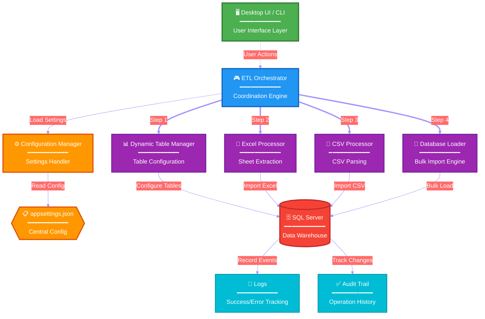
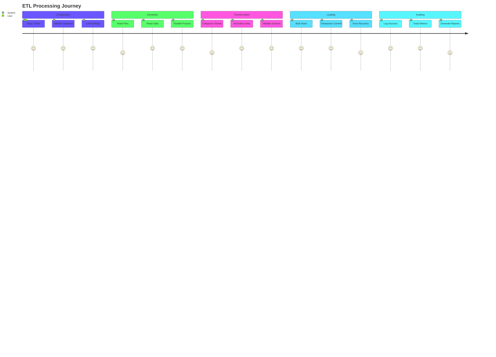

<div align="center">

<!-- Hero Banner -->
<picture>
  <source media="(prefers-color-scheme: dark)" srcset="https://capsule-render.vercel.app/api?type=waving&color=gradient&customColorList=6,11,20&height=300&section=header&text=DataForge%20ETL&fontSize=90&fontAlignY=38&desc=Enterprise-Grade%20ETL%20System%20for%20Excel%20%26%20CSV%20to%20SQL%20Server&descAlignY=55&descSize=20&animation=fadeIn">
  
</picture>

<br/>

<!-- Animated Typing Effect -->
<p align="center">
  <a href="https://git.io/typing-svg">
    
  </a>
</p>

<!-- Tech Stack Badges with Animation -->
<p align="center">
  
  
  
  
  
  
</p>

<!-- Status Badges -->
<p align="center">
  
  
  
  
  
</p>

<!-- Quick Navigation with Icons -->
<p align="center">
  <a href="#-key-features">
    
  </a>
  <a href="#-quick-start">
    
  </a>
  <a href="#-installation">
    
  </a>
  <a href="#️-configuration">
    
  </a>
  <a href="#-documentation">
    
  </a>
</p>

<!-- Decorative Divider -->


</div>

<br/>

<!-- Table of Contents with Beautiful Styling -->
<details open>
<summary><b>📋 Table of Contents</b></summary>

<br/>



<table>
<tr>
<td width="33%">

**🚀 Getting Started**
- [🎯 Key Features](#-key-features)
- [⚡ Quick Start](#-quick-start)
- [📦 Installation](#-installation)
- [⚙️ Configuration](#️-configuration)

</td>
<td width="33%">

**📚 Documentation**
- [🏗️ Architecture](#️-architecture)
- [💻 Usage](#-usage)
- [📂 Project Structure](#-project-structure)
- [🔧 Modules](#-modules)

</td>
<td width="33%">

**🛠️ Advanced**
- [🛠️ Development](#️-development)
- [❓ Troubleshooting](#-troubleshooting)
- [🤝 Contributing](#-contributing)
- [📄 License](#-license)

</td>
</tr>
</table>

</details>


<br/>

## 🎯 Key Features

<div align="center">

### ✨ **Powerful ETL Features at Your Fingertips**

</div>

<!-- Feature Cards with Visual Appeal -->
<table>
<tr>
<td width="33%" align="center">

### 🔄 **Unified Pipeline**


Complete workflow from Excel/CSV to database with seamless integration

</td>
<td width="33%" align="center">

### ⚡ **Dynamic Configuration**


Runtime table mapping with interactive user input wizard

</td>
<td width="33%" align="center">

### 🚀 **Parallel Processing**


Multi-threaded sheet extraction & lightning-fast data loading

</td>
</tr>

<tr>
<td width="33%" align="center">

### 📊 **Dual Format Support**


Excel (.xlsx, .xls) and CSV file processing

</td>
<td width="33%" align="center">

### 🎯 **Smart Categorization**


Intelligent sheet routing (SUP, DEM) with custom keywords

</td>
<td width="33%" align="center">

### ✅ **Schema Validation**


Column validation & schema matching before import

</td>
</tr>

<tr>
<td width="33%" align="center">

### 💾 **Bulk Import**


Optimized SqlBulkCopy handling 1M+ rows per batch

</td>
<td width="33%" align="center">

### 📝 **Comprehensive Logging**


Console, file, and database audit trails with detailed tracking

</td>
<td width="33%" align="center">

### 🛡️ **Error Recovery**


Continue-on-error with transaction safety & rollback

</td>
</tr>
</table>

<br/>

<!-- Why Choose Section with Modern Design -->
<div align="center">

### 🌟 **Why Choose DataForge ETL?**

<table>
<tr>
<td width="25%" align="center">


**Self-Contained**

No external runtime dependencies required

</td>
<td width="25%" align="center">


**Environment-Agnostic**

Works across dev, test, and production

</td>
<td width="25%" align="center">


**Modular Architecture**

Independent, reusable components

</td>
<td width="25%" align="center">


**Performance Optimized**

Handles millions of rows efficiently

</td>
</tr>

<tr>
<td width="25%" align="center">


**Enterprise-Ready**

Battle-tested in production environments

</td>
<td width="25%" align="center">


**Dual Interfaces**

Desktop UI & CLI for flexibility

</td>
<td width="25%" align="center">


**Secure Config**

Centralized appsettings.json management

</td>
<td width="25%" align="center">


**Production Ready**

Version 2.0 with full test coverage

</td>
</tr>
</table>

</div>


<br/>

## 🏗️ Architecture

<div align="center">

### 🎨 **System Architecture Overview**

</div>

<!-- Architecture Diagram with Enhanced Styling -->
<div align="center">



</div>

<br/>

<div align="center">

### 🔄 **ETL Workflow Pipeline**

</div>

<!-- Workflow with Visual Steps -->
<table>
<tr>
<td align="center" width="20%">


### **1️⃣ Configure**

```yaml
• Set table mappings
• Interactive wizard
• Database validation
• Schema verification
```


</td>
<td align="center" width="20%">


### **2️⃣ Extract**

```yaml
• Read Excel sheets
• Parse CSV files
• Parallel processing
• Format detection
```


</td>
<td align="center" width="20%">


### **3️⃣ Transform**

```yaml
• Split by keywords
• Normalize data
• Validate schemas
• Type conversion
```


</td>
<td align="center" width="20%">


### **4️⃣ Load**

```yaml
• Bulk insert data
• Transaction safety
• Error handling
• Rollback support
```


</td>
<td align="center" width="20%">


### **5️⃣ Audit**

```yaml
• Log everything
• Track metrics
• Error reporting
• Performance data
```


</td>
</tr>
</table>

<!-- Animated Process Flow -->
<div align="center">



</div>


<br/>

## ⚡ Quick Start

<div align="center">

### 🚀 **Get Started in 3 Simple Steps**


</div>

<br/>

<!-- Option Cards with Beautiful Design -->
<table>
<tr>
<td width="50%" valign="top">

<div align="center">

### 🖥️ **Desktop Application**


</div>

```powershell
# ╔══════════════════════════════════╗
# ║  Step 1: Build the Application  ║
# ╚══════════════════════════════════╝
.\Build_All_Release.bat

# ╔══════════════════════════════════╗
# ║  Step 2: Configure Settings      ║
# ╚══════════════════════════════════╝
notepad appsettings.json

# ╔══════════════════════════════════╗
# ║  Step 3: Launch Desktop UI       ║
# ╚══════════════════════════════════╝
.\DataForgeETL.UI.bat
```

<div align="center">

**✨ Features:**
- 🎨 Modern Avalonia UI
- 📊 Real-time monitoring
- 🖱️ Point-and-click interface
- 📈 Live progress tracking

</div>

</td>
<td width="50%" valign="top">

<div align="center">

### 💻 **Command Line Interface**


</div>

```powershell
# ╔══════════════════════════════════╗
# ║  Step 1: Build All Modules       ║
# ╚══════════════════════════════════╝
.\Build_All_Release.bat

# ╔══════════════════════════════════╗
# ║  Step 2: Configure Settings      ║
# ╚══════════════════════════════════╝
notepad appsettings.json

# ╔══════════════════════════════════╗
# ║  Step 3: Run Workflow            ║
# ╚══════════════════════════════════╝
# Excel workflow
.\ETL_Excel_Orchestrator.bat

# CSV workflow
.\ETL_CSV_Orchestrator.bat
```

<div align="center">

**⚡ Features:**
- 🤖 Automation-ready
- 🔧 Script-friendly
- ⚙️ Advanced options
- 🔄 CI/CD integration

</div>

</td>
</tr>
</table>

<br/>

<!-- Success Animation -->
<div align="center">


### 🎉 **That's It! Your ETL Pipeline is Ready!**

<table>
<tr>
<td align="center" width="33%">


**Quick Setup**

5 minutes to production

</td>
<td align="center" width="33%">


**Instant Processing**

Start processing immediately

</td>
<td align="center" width="33%">


**Scalable**

Handle millions of rows

</td>
</tr>
</table>

</div>


<br/>

## 📦 Installation

<div align="center">

### 🎯 **System Requirements & Setup**


</div>

<br/>

<!-- Prerequisites Cards with Visual Design -->
<table>
<tr>
<td width="33%" align="center" valign="top">


### 🖥️ **System**


```yaml
Operating System:
  Windows 10/11 or Server 2016+

Memory:
  4GB RAM minimum
  8GB+ recommended

Storage:
  500MB disk space minimum
  SSD recommended

Permissions:
  Administrator rights for SQL
```


</td>
<td width="33%" align="center" valign="top">


### ⚙️ **Runtime**


```yaml
.NET Framework:
  .NET 8.0 SDK

Database:
  SQL Server 2016+
  Azure SQL Database

Architecture:
  Windows x64 only

Version Control:
  Git (optional)
```


</td>
<td width="33%" align="center" valign="top">


### 🛠️ **Development**


```yaml
IDE Options:
  Visual Studio 2022
  VS Code + C# Dev Kit

Database Tools:
  SQL Server Management Studio
  Azure Data Studio

Shell:
  PowerShell 5.1+
  Windows Terminal

Extensions:
  C# Dev Kit for VS Code
```


</td>
</tr>
</table>

<br/>

<!-- Installation Progress Indicator -->
<div align="center">

### 📥 **Installation Methods**


</div>

<br/>

<details open>
<summary>
<b>📥 Method 1: Clone Repository</b>

</summary>

<br/>

<table width="100%">
<tr>
<td width="10%" align="center">

**Step 1**


</td>
<td width="90%">

**Clone the Repository**

```powershell
git clone https://github.com/yourusername/DataForge_ETL.git
cd DataForge_ETL
```

</td>
</tr>

<tr>
<td width="10%" align="center">

**Step 2**


</td>
<td width="90%">

**Build All Modules**

```powershell
.\Build_All_Release.bat
```


</td>
</tr>

<tr>
<td width="10%" align="center">

**Step 3**


</td>
<td width="90%">

**Configure Settings**

```powershell
notepad appsettings.json
```

Update these key settings:
- `Database.Server` → Your SQL Server instance
- `Database.Database` → Target database name
- `Paths.InputExcelFiles` → Source files location

</td>
</tr>

<tr>
<td width="10%" align="center">

**Step 4**


</td>
<td width="90%">

**Launch Application**

```powershell
# Desktop UI (Recommended)
.\DataForgeETL.UI.bat

# OR Command Line
.\ETL_Excel_Orchestrator.bat
```

</td>
</tr>
</table>

<div align="center">

✅ **Installation Complete!** Ready to process data.

</div>

</details>

<details>
<summary>
<b>🔨 Method 2: Self-Contained Deployment</b>

</summary>

<br/>

```powershell
# ╔═══════════════════════════════════════════════════════╗
# ║  Self-Contained Build - No Runtime Dependencies      ║
# ╚═══════════════════════════════════════════════════════╝

# 1. Clone repository
git clone https://github.com/yourusername/DataForge_ETL.git
cd DataForge_ETL

# 2. Build with included .NET runtime
.\Build_All_SelfContained.bat

# 3. Configure settings
notepad appsettings.json

# 4. Deploy entire folder to target machine
# ✅ No .NET installation required on target!
```

<div align="center">

**✨ Benefits & Trade-offs**

</div>

<table>
<tr>
<td width="50%" valign="top">

**✅ Advantages**

- ✔️ No .NET runtime needed on deployment machine
- ✔️ Consistent runtime version across environments
- ✔️ Simplified deployment and distribution
- ✔️ Isolated from system .NET installations
- ✔️ Perfect for air-gapped environments

</td>
<td width="50%" valign="top">

**⚠️ Considerations**

- ⚠️ Larger file size (~70-100MB per executable)
- ⚠️ Longer build times
- ⚠️ More disk space required
- ⚠️ Separate builds for each OS/architecture

</td>
</tr>
</table>

<div align="center">


</div>

</details>

<details>
<summary>
<b>📦 Method 3: Individual Module Build</b>

</summary>

<br/>

**Build specific modules individually:**

```powershell
# Core Orchestrator
cd Core
dotnet build -c Release

# Dynamic Table Manager
cd ..\ETL_DynamicTableManager
dotnet build -c Release

# Excel Processor
cd ..\ETL_Excel
dotnet build -c Release

# Database Loader
cd ..\ETL_ExcelToDatabase
dotnet build -c Release

# CSV Processor
cd ..\ETL_CsvToDatabase
dotnet build -c Release

# Desktop UI
cd ..\DataForgeETL.UI
dotnet build -c Release
```

<div align="center">

**🎯 Use Case:** Need only specific modules or custom build configuration

</div>

</details>


<br/>

## ⚙️ Configuration

<div align="center">

### 🎛️ **Centralized Configuration Management**


**Single configuration file controls the entire application**

</div>

<br/>

<table>
<tr>
<td width="33%" align="center">


**Single Source of Truth**

One file for all settings

</td>
<td width="33%" align="center">


**Root Directory**

Located in project root

</td>
<td width="33%" align="center">


**Easy Management**

Simple JSON structure

</td>
</tr>
</table>

<br/>

<details open>
<summary>
<b>🔧 Complete Configuration Structure</b>

</summary>

<br/>

```json
{
  "Environment": {
    "RootDirectory": "AUTO_DETECT",
    "Environment": "Production"
  },
  "Database": {
    "Server": "YOUR_SERVER\\INSTANCE",
    "Database": "YOUR_DATABASE",
    "IntegratedSecurity": true,
    "Username": "",
    "Password": "",
    "ConnectionTimeout": 600,
    "CommandTimeout": 0
  },
  "Paths": {
    "InputExcelFiles": "YOUR_INPUT_PATH",
    "InputCsvFiles": "YOUR_CSV_PATH",
    "OutputExcelFiles": "YOUR_OUTPUT_PATH",
    "SpecialExcelFiles": "YOUR_SPECIAL_PATH",
    "LogFiles": "Logs",
    "TempFiles": "Temp"
  },
  "ExecutableModules": {
    "DynamicTableManager": {
      "RelativePath": "ETL_DynamicTableManager\\bin\\Release\\net8.0\\win-x64\\ETL_DynamicTableManager.exe",
      "Name": "Dynamic Table Manager",
      "Description": "Configures dynamic table names for ETL process",
      "Order": 1,
      "Arguments": ""
    },
    "ExcelProcessor": {
      "RelativePath": "ETL_Excel\\bin\\Release\\net8.0\\win-x64\\ETL_Excel.exe",
      "Name": "Excel Processor",
      "Description": "Processes and splits Excel files",
      "Order": 2,
      "Arguments": "--non-interactive"
    },
    "DatabaseLoader": {
      "RelativePath": "ETL_ExcelToDatabase\\bin\\Release\\net8.0\\win-x64\\ETL_ExcelToDatabase.exe",
      "Name": "Database Loader",
      "Description": "Loads processed data into database",
      "Order": 3,
      "Arguments": ""
    },
    "CsvToDatabase": {
      "RelativePath": "ETL_CsvToDatabase\\bin\\Release\\net8.0\\win-x64\\ETL_CsvToDatabase.exe",
      "Name": "CSV to Database",
      "Description": "Loads CSV files directly into database",
      "Order": 4,
      "Arguments": ""
    }
  },
  "Processing": {
    "BatchSize": 1000000,
    "ValidateColumnMapping": true,
    "DefaultSheetName": "Sheet1",
    "SpecialSheetKeywords": ["SUP", "DEM"]
  },
  "Logging": {
    "Level": "Information",
    "EnableFileLogging": true,
    "EnableConsoleLogging": true,
    "LogRetentionDays": 30,
    "MaxLogFileSizeMB": 100
  },
  "Tables": {
    "ErrorTableName": "Error_table",
    "SuccessLogTableName": "Success_table",
    "AutoCreateLogTables": true
  },
  "Notifications": {
    "Csv": {
      "EnableProgressNotifications": true,
      "ProgressNotificationInterval": 50000
    },
    "Excel": {
      "EnableProgressNotifications": true,
      "ProgressNotificationInterval": 50000
    }
  }
}
```

</details>

<div align="center">

### 🎯 **Configuration Quick Reference**


</div>

<br/>

| Section | Setting | Description | Required | Default/Example |
|---------|---------|-------------|----------|-----------------|
| **🌍 Environment** | `RootDirectory` | Project root (auto-detected if not set) | ⚙️ Optional | `AUTO_DETECT` |
| | `Environment` | Runtime environment | ⚙️ Optional | `Production` |
| **🗄️ Database** | `Server` | SQL Server instance name | ✅ Yes | `localhost\\SQLEXPRESS` |
| | `Database` | Target database name | ✅ Yes | `RAW_PROCESS` |
| | `IntegratedSecurity` | Use Windows Authentication | ✅ Yes | `true` |
| | `Username` | SQL auth username (if not integrated) | ⚙️ Optional | `""` |
| | `Password` | SQL auth password (if not integrated) | ⚙️ Optional | `""` |
| | `ConnectionTimeout` | Connection timeout (seconds) | ⚙️ Optional | `600` |
| **📁 Paths** | `InputExcelFiles` | Source Excel files directory | ✅ Yes | Absolute or relative path |
| | `InputCsvFiles` | Source CSV files directory | ✅ Yes | Absolute or relative path |
| | `OutputExcelFiles` | Processed Excel output | ✅ Yes | Absolute or relative path |
| | `SpecialExcelFiles` | Categorized sheets output | ⚙️ Optional | Absolute or relative path |
| | `LogFiles` | Application logs directory | ⚙️ Optional | `Logs` (relative) |
| | `TempFiles` | Temporary files directory | ⚙️ Optional | `Temp` (relative) |
| **⚡ Processing** | `BatchSize` | Rows per bulk insert | ⚙️ Optional | `1000000` |
| | `ValidateColumnMapping` | Enable schema validation | ⚙️ Optional | `true` |
| | `SpecialSheetKeywords` | Sheet categorization keywords | ⚙️ Optional | `["SUP", "DEM"]` |
| **📝 Logging** | `Level` | Log verbosity | ⚙️ Optional | `Information` |
| | `EnableFileLogging` | Write logs to files | ⚙️ Optional | `true` |
| | `LogRetentionDays` | Auto-cleanup old logs | ⚙️ Optional | `30` |
| **🗃️ Tables** | `ErrorTableName` | Error logging table | ✅ Yes | `Error_table` |
| | `SuccessLogTableName` | Success audit table | ✅ Yes | `Success_table` |
| | `AutoCreateLogTables` | Create log tables if missing | ⚙️ Optional | `true` |
| **🔔 Notifications.Csv** | `EnableProgressNotifications` | Show progress updates for CSV | ⚙️ Optional | `true` |
| | `ProgressNotificationInterval` | Rows between progress updates | ⚙️ Optional | `50000` |
| **🔔 Notifications.Excel** | `EnableProgressNotifications` | Show progress updates for Excel | ⚙️ Optional | `true` |
| | `ProgressNotificationInterval` | Rows between progress updates | ⚙️ Optional | `50000` |

<br/>

<div align="center">

### 🔒 **Configuration Best Practices**


</div>

<table>
<tr>
<td width="50%" valign="top">

**✅ Do's**

```yaml
✔️ Use relative paths when possible
   Example: "Logs", "Temp"

✔️ Store appsettings.json in source control
   (without sensitive data)

✔️ Use environment variables for credentials
   Example: %SQL_PASSWORD%

✔️ Set RootDirectory to "AUTO_DETECT"
   For location-agnostic deployment

✔️ Enable IntegratedSecurity
   For Windows environments

✔️ Configure BatchSize based on RAM
   4GB RAM → 100K batch
   8GB RAM → 500K batch
   16GB+ → 1M+ batch

✔️ Enable ValidateColumnMapping
   Prevent import errors early
```

</td>
<td width="50%" valign="top">

**❌ Don'ts**

```yaml
✖️ Don't hardcode passwords
   Use Windows Auth or env vars

✖️ Don't use absolute paths unnecessarily
   Breaks portability

✖️ Don't disable validation in production
   ValidateColumnMapping: false

✖️ Don't set BatchSize too high
   Can cause memory issues

✖️ Don't ignore ConnectionTimeout
   Adjust for slow networks

✖️ Don't store config outside root
   Keep centralized

✖️ Don't commit sensitive data
   Use .gitignore for secrets
```

</td>
</tr>
</table>

<div align="center">


</div>


<br/>

## 💻 Usage

### 🖥️ **Desktop Application (Avalonia UI)**

<div align="center">

```powershell
# Launch the modern desktop interface
.\DataForgeETL.UI.bat
```

**🎨 Modern cross-platform UI with MVVM architecture**

</div>

#### ✨ **Desktop UI Features**

<table>
<tr>
<td align="center" width="25%">

**📊 Dashboard**  
System status overview  
Quick action buttons  
Real-time execution logs  
Performance metrics

</td>
<td align="center" width="25%">

**⚙️ Configuration**  
Interactive setup wizard  
Database connectivity test  
Visual table management  
Configuration preview

</td>
<td align="center" width="25%">

**📈 Monitoring**  
Live progress tracking  
Real-time row counters  
Processing statistics  
Time estimates

</td>
<td align="center" width="25%">

**📝 Logging**  
Color-coded messages  
Severity filtering  
Search & export  
Historical views

</td>
</tr>
</table>

**Technology Stack:**
- 🎨 Avalonia UI 11.0.6 - Cross-platform framework
- 🏗️ MVVM Pattern - Clean architecture
- 🔄 Reactive Design - Real-time updates
- 📱 Responsive Layout - Adaptive interface

---

### 💻 **Command Line Interface (CLI)**

#### 🎮 **Orchestrators (Recommended)**

```powershell
# Excel Workflow: Configure → Process → Load
.\ETL_Excel_Orchestrator.bat

# CSV Workflow: Configure → Load
.\ETL_CSV_Orchestrator.bat
```

#### 🔧 **Individual Modules**

```powershell
# 1️⃣ Configure table mappings (Interactive)
cd ETL_DynamicTableManager
.\ETL_DynamicTableManager.bat

# 2️⃣ Process Excel files (Automated)
cd ..\ETL_Excel
.\ETL_Excel.bat

# 3️⃣ Import Excel data to database
cd ..\ETL_ExcelToDatabase
.\ETL_ExcelToDatabase.bat

# 4️⃣ Import CSV data to database
cd ..\ETL_CsvToDatabase
.\ETL_CsvToDatabase.bat
```

#### ⚡ **Advanced CLI Options**

<table>
<tr>
<td width="50%">

**Core Orchestrator Options**
```powershell
# Skip table configuration
DataForgeETL.exe --skip-dynamic-config

# Continue on errors
DataForgeETL.exe --continue-on-error

# Show configuration
DataForgeETL.exe --show-config

# Set custom root directory
DataForgeETL.exe --root-directory "CUSTOM_PATH"

# Run specific module only
DataForgeETL.exe --dynamic-table-only
DataForgeETL.exe --excel-only
DataForgeETL.exe --database-only
```

</td>
<td width="50%">

**Module-Specific Options**
```powershell
# Excel Processor
ETL_Excel.exe --non-interactive
ETL_Excel.exe --input-path "CUSTOM_PATH"
ETL_Excel.exe --output-path "CUSTOM_PATH"

# Database Loader
ETL_ExcelToDatabase.exe --skip-validation
ETL_ExcelToDatabase.exe --batch-size 500000
ETL_ExcelToDatabase.exe --continue-on-error

# CSV Processor
ETL_CsvToDatabase.exe --delimiter ","
ETL_CsvToDatabase.exe --has-header true
```

</td>
</tr>
</table>

---

## 📂 Project Structure

```
DataForge_ETL/
│
├── 📄 appsettings.json                    # ⭐ Centralized configuration
├── 📄 dynamic_table_config.json           # Runtime table mappings
│
├── 🚀 Build_All_Release.bat               # Build all modules (Release)
├── 🚀 Build_All_SelfContained.bat         # Build self-contained deployment
├── 🎮 ETL_Excel_Orchestrator.bat          # Excel workflow launcher
├── 🎮 ETL_CSV_Orchestrator.bat            # CSV workflow launcher
├── 🖥️ DataForgeETL.UI.bat           # Desktop UI launcher
│
├── 📁 Core/                                # 🎯 Orchestrator & Configuration
│   ├── Program.cs                          # CLI entry point
│   ├── ETLOrchestrator.cs                  # Module coordinator
│   ├── UnifiedConfigurationManager.cs      # Central config handler
│   └── UnifiedConfigurationModels.cs       # Config models
│
├── 📁 ETL_DynamicTableManager/             # ⚙️ Interactive Table Configuration
│   ├── Program.cs                          # Entry point
│   ├── ETL_DynamicTableManager.bat         # Module launcher
│   ├── Services/
│   │   ├── TableConfigurationService.cs    # Table config logic
│   │   └── UserInputService.cs             # User interaction
│   ├── Configuration/
│   │   └── ConfigurationModels.cs          # Data models
│   └── Core/
│       ├── DatabaseOperations.cs           # DB operations
│       └── UnifiedConfigurationManager.cs  # Module config
│
├── 📁 ETL_Excel/                           # 📊 Excel Processor
│   ├── Program.cs                          # Entry point
│   ├── ETL_Excel.bat                       # Module launcher
│   ├── Modules/
│   │   ├── ExcelProcessor.cs               # Sheet splitting logic
│   │   ├── FileManager.cs                  # File operations
│   │   └── ConfigurationManager.cs         # Module config
│   └── Core/
│       └── UnifiedConfigurationManager.cs  # Shared config
│
├── 📁 ETL_ExcelToDatabase/                 # 💾 Excel Database Loader
│   ├── Program.cs                          # Entry point
│   ├── ETL_ExcelToDatabase.bat             # Module launcher
│   ├── Core/
│   │   ├── DatabaseOperations.cs           # Bulk import operations
│   │   ├── ConfigurationLoader.cs          # Config loader
│   │   └── UnifiedConfigurationManager.cs  # Shared config
│   ├── Services/
│   │   ├── ValidationService.cs            # Column validation
│   │   ├── LoggingService.cs               # Error/success logging
│   │   └── DynamicConfigurationService.cs  # Dynamic table config
│   └── Models/
│       └── ConfigurationModels.cs          # Data models
│
├── 📁 ETL_CsvToDatabase/                   # 📄 CSV Database Loader
│   ├── Program.cs                          # Entry point
│   ├── ETL_CsvToDatabase.bat               # Module launcher
│   ├── Core/
│   │   ├── DatabaseOperations.cs           # CSV bulk import
│   │   ├── ConfigurationLoader.cs          # Config loader
│   │   └── UnifiedConfigurationManager.cs  # Shared config
│   ├── Services/
│   │   ├── CsvProcessingService.cs         # CSV parsing
│   │   ├── ValidationService.cs            # Schema validation
│   │   └── LoggingService.cs               # Logging
│   └── Models/
│       └── ConfigurationModels.cs          # Data models
│
├── 📁 DataForgeETL.UI/               # 🖥️ Avalonia Desktop Application
│   ├── App.axaml                           # Application root
│   ├── ViewModels/
│   │   ├── MainWindowViewModel.cs          # Main window logic
│   │   ├── DashboardViewModel.cs           # Dashboard view
│   │   ├── DynamicTableConfigViewModel.cs  # Table config UI
│   │   ├── ExcelProcessorViewModel.cs      # Excel processing UI
│   │   └── DatabaseLoaderViewModel.cs      # Database import UI
│   ├── Views/
│   │   ├── MainWindow.axaml                # Main window layout
│   │   ├── DashboardView.axaml             # Dashboard UI
│   │   ├── DynamicTableConfigView.axaml    # Config wizard UI
│   │   ├── ExcelProcessorView.axaml        # Excel processing UI
│   │   └── DatabaseLoaderView.axaml        # Import UI
│   ├── Services/
│   │   ├── IUILogger.cs                    # Logging interface
│   │   ├── AvaloniaLogger.cs               # UI logger
│   │   └── INavigationService.cs           # Navigation
│   └── DataForgeETL.UI.bat           # UI launcher
│
├── 📁 Logs/                                # 📝 Application Logs
│   ├── Console_output_log_*.txt            # Console output
│   ├── ETL_DynamicTableManager_*.txt       # Table manager logs
│   ├── ETL_Excel_*.txt                     # Excel processing logs
│   ├── ETL_ExcelToDatabase_*.txt           # Import logs
│   └── ETL_CsvToDatabase_*.txt             # CSV import logs
│
├── 📁 Temp/                                # 🗂️ Temporary Files
│
└── 📁 .git/                                # Git repository

```

### 🏗️ **Architecture Highlights**

- **🎯 Unified Configuration**: Single `appsettings.json` for all modules
- **🔄 Shared Components**: `UnifiedConfigurationManager` in each module
- **📦 Modular Design**: Each module is self-contained and independently runnable
- **🎨 MVVM Pattern**: Clean separation in UI application
- **📝 Centralized Logging**: All logs in `Logs/` directory
- **⚙️ Dynamic Configuration**: Runtime table mapping via `dynamic_table_config.json`

---

## 🔧 Modules

<table>
<tr>
<td align="center" width="20%">

### 🎮
**Orchestrator**

Centralized ETL control

[Details ↓](#1-core-orchestrator)

</td>
<td align="center" width="20%">

### ⚙️
**Table Manager**

Interactive configuration

[Details ↓](#2-dynamic-table-manager)

</td>
<td align="center" width="20%">

### 📊
**Excel Processor**

Multi-sheet processing

[Details ↓](#3-excel-processor)

</td>
<td align="center" width="20%">

### 💾
**Database Loader**

Bulk data import

[Details ↓](#4-database-loader)

</td>
<td align="center" width="20%">

### 📄
**CSV Processor**

CSV file import

[Details ↓](#5-csv-to-database)

</td>
</tr>
</table>

---

### 1. Core Orchestrator

**📍 Location:** `Core/`  
**🎯 Purpose:** Centralized command center for ETL pipeline execution

#### ✨ Features
- ✅ Loads unified configuration from `appsettings.json`
- ✅ Executes modules in configured order
- ✅ Handles errors and provides detailed logging
- ✅ Provides comprehensive CLI interface
- ✅ Supports skip flags and custom root directory

#### 🔑 Key Components
- `Program.cs` - Entry point & CLI argument parsing
- `ETLOrchestrator.cs` - Module coordinator & execution engine
- `UnifiedConfigurationManager.cs` - Configuration handler

#### 💻 Usage
```powershell
# Run complete pipeline
DataForgeETL.exe

# Skip dynamic configuration
DataForgeETL.exe --skip-dynamic-config

# Custom root directory
DataForgeETL.exe --root-directory "YOUR_PATH"
```

---

### 2. Dynamic Table Manager

**📍 Location:** `ETL_DynamicTableManager/`  
**🎯 Purpose:** Interactive wizard for runtime table configuration

#### ✨ Features
- ✅ Interactive prompts for temp/destination table names
- ✅ Real-time database connectivity validation
- ✅ Table existence verification
- ✅ Creates new tables if requested
- ✅ Saves configuration to `dynamic_table_config.json`
- ✅ Prevents accidental overwrites with confirmation prompts

#### 🔑 Key Components
- `TableConfigurationService.cs` - Core configuration logic
- `UserInputService.cs` - User interaction handling
- `DatabaseOperations.cs` - SQL Server operations

#### 🔄 Workflow
```
1. User selects temporary staging table name
2. Choose existing destination or create new
3. Validate against SQL Server connection
4. Confirm configuration details
5. Save to dynamic_table_config.json
6. Ready for next module to consume
```

#### 💻 Usage
```powershell
.\ETL_DynamicTableManager\ETL_DynamicTableManager.bat
```

---

### 3. Excel Processor

**📍 Location:** `ETL_Excel/`  
**🎯 Purpose:** Split multi-sheet Excel workbooks into individual files

#### ✨ Features
- ✅ Parallel sheet processing for performance
- ✅ Keyword-based categorization (SUP, DEM sheets)
- ✅ Preserves formulas and formatting
- ✅ Creates individual Excel file per sheet
- ✅ Outputs to categorized directories
- ✅ Comprehensive progress reporting

#### 🔑 Key Components
- `ExcelProcessor.cs` - Sheet splitting logic using ClosedXML
- `FileManager.cs` - File operations & organization
- `ConfigurationManager.cs` - Module-specific configuration

#### 📂 Output Structure
```
OutputExcelFiles/          # Regular sheets
SpecialExcelFiles/         # Categorized sheets (SUP, DEM)
```

#### 💻 Usage
```powershell
.\ETL_Excel\ETL_Excel.bat

# Or non-interactive mode
ETL_Excel.exe --non-interactive
```

---

### 4. Database Loader (Excel to Database)

**📍 Location:** `ETL_ExcelToDatabase/`  
**🎯 Purpose:** Bulk import Excel data with validation

#### ✨ Features
- ✅ Three-phase import: Staging → Validation → Transfer
- ✅ Column mapping validation before import
- ✅ SqlBulkCopy optimization (1M+ rows/batch)
- ✅ Automatic type inference from Excel
- ✅ Transaction safety with automatic rollback
- ✅ Comprehensive error logging to database

#### 🔑 Key Components
- `DatabaseOperations.cs` - Bulk import operations
- `ValidationService.cs` - Schema & column validation
- `LoggingService.cs` - Error/success audit trail
- `DynamicConfigurationService.cs` - Dynamic table config loader

#### 🔄 Import Strategy
```
📥 Load to Temp Table
    ↓
✅ Validate Columns
    ↓
💾 Transfer to Destination
    ↓
📝 Log Success/Errors
```

#### 💻 Usage
```powershell
.\ETL_ExcelToDatabase\ETL_ExcelToDatabase.bat

# Or with options
ETL_ExcelToDatabase.exe --skip-validation
ETL_ExcelToDatabase.exe --batch-size 500000
```

---

### 5. CSV to Database

**📍 Location:** `ETL_CsvToDatabase/`  
**🎯 Purpose:** Direct CSV file import to SQL Server

#### ✨ Features
- ✅ Integrates Dynamic Table Manager automatically
- ✅ Fast CSV parsing with CsvHelper library
- ✅ Delimiter auto-detection
- ✅ Header row detection
- ✅ Bulk insert optimization
- ✅ Schema validation before import
- ✅ Detailed error reporting per file

#### 🔑 Key Components
- `CsvProcessingService.cs` - CSV parsing & processing
- `DatabaseOperations.cs` - Bulk insert operations
- `ValidationService.cs` - Schema validation
- `LoggingService.cs` - Comprehensive logging

#### 🔄 Workflow
```
1. Invoke Dynamic Table Manager (if needed)
2. Scan CSV files in InputCsvFiles directory
3. Parse CSV headers and data
4. Validate against destination table
5. Bulk insert to database
6. Log results to Success/Error tables
```

#### 💻 Usage
```powershell
.\ETL_CsvToDatabase\ETL_CsvToDatabase.bat

# Or via orchestrator
.\ETL_CSV_Orchestrator.bat
```

---

### 6. Desktop UI Application

**📍 Location:** `DataForgeETL.UI/`  
**🎯 Purpose:** Modern cross-platform desktop interface

#### ✨ Features
- ✅ **MVVM Architecture** - Clean separation of concerns
- ✅ **Real-time Monitoring** - Live progress tracking
- ✅ **Interactive Configuration** - Visual setup wizards
- ✅ **Color-coded Logging** - Easy error identification
- ✅ **Performance Metrics** - Execution time & row counts
- ✅ **Multi-view Navigation** - Dashboard, Config, Processing, Import

#### 🏗️ Technology Stack
- 🎨 Avalonia UI 11.0.6 - Cross-platform XAML framework
- 🔄 CommunityToolkit.Mvvm - MVVM helpers
- 📊 LiveCharts - Real-time charting
- 🎯 Reactive Design - Data binding & notifications

#### 📱 User Interface

**Dashboard View**
- System status cards (Database, Files, Configuration)
- Quick action buttons
- Recent execution history
- Live log viewer

**Dynamic Table Config View**
- Step-by-step wizard
- Database connectivity test
- Table selection dropdown
- Configuration preview

**Excel Processor View**
- File selection browser
- Processing progress bar
- Sheet categorization display
- Performance statistics

**Database Loader View**
- Import progress tracking
- Column validation results
- Row count metrics
- Error/success summary

#### 💻 Usage
```powershell
.\DataForgeETL.UI.bat

# Or directly
.\DataForgeETL.UI\bin\Release\net8.0\win-x64\DataForgeETL.UI.exe
```

---

## 🛠️ Development

### 🔨 **Building the Solution**

```powershell
# Build all modules in Release mode
.\Build_All_Release.bat

# Build self-contained deployment (includes .NET runtime)
.\Build_All_SelfContained.bat

# Build individual module
cd Core
dotnet build -c Release

# Publish self-contained for specific module
dotnet publish -c Release -r win-x64 --self-contained true
```

### 🧪 **Testing**

```powershell
# Run unit tests (if available)
dotnet test

# Test database connection
cd ETL_DynamicTableManager
.\ETL_DynamicTableManager.bat
# Select option to test connection

# Dry run with test data
# Place sample files in InputExcelFiles
.\ETL_Excel_Orchestrator.bat
```

### 🔍 **Debugging**

```powershell
# Enable verbose logging
# Set Logging.Level to "Debug" in appsettings.json

# Check detailed logs
cd Logs
Get-Content Console_output_log_*.txt -Tail 50

# Query error logs in database
# SELECT TOP 100 * FROM Error_table ORDER BY Timestamp DESC

# View success audit
# SELECT TOP 100 * FROM Success_table ORDER BY ProcessingDate DESC
```

### 📦 **Adding New Modules**

1. **Create new .NET 8.0 project**
```powershell
dotnet new console -n ETL_YourModule
cd ETL_YourModule
dotnet add reference ..\Core\DataForgeETL.csproj
```

2. **Copy UnifiedConfigurationManager** from another module

3. **Add module to appsettings.json**
```json
"ExecutableModules": {
  "YourModule": {
    "RelativePath": "ETL_YourModule\\bin\\Release\\net8.0\\win-x64\\ETL_YourModule.exe",
    "Name": "Your Module Name",
    "Description": "Module description",
    "Order": 5,
    "Arguments": ""
  }
}
```

4. **Create module launcher batch file**
```batch
@echo off
set EXE_PATH=bin\Release\net8.0\win-x64\ETL_YourModule.exe

if not exist "%EXE_PATH%" (
    echo Building module...
    dotnet build -c Release
)

"%EXE_PATH%"
pause
```

---

## ❓ Troubleshooting

### 🔍 **Common Issues & Solutions**

<details>
<summary><b>❌ Database Connection Failed</b></summary>

**Symptoms:** Cannot connect to SQL Server

**Checklist:**
- [ ] SQL Server service is running: `Get-Service MSSQL*`
- [ ] Server name is correct in `appsettings.json`
- [ ] Database exists: `SELECT DB_ID('YOUR_DATABASE')`
- [ ] Windows Authentication enabled OR credentials valid
- [ ] Firewall allows SQL Server connections (port 1433)
- [ ] Named pipes/TCP-IP protocols enabled

**Solutions:**
```powershell
# Test connection manually
sqlcmd -S YOUR_SERVER\INSTANCE -d YOUR_DATABASE -Q "SELECT @@VERSION"

# Verify configuration
DataForgeETL.exe --show-config

# Check SQL Server configuration
SQL Server Configuration Manager → Protocols → Enable TCP/IP
```

</details>

<details>
<summary><b>📁 Files Not Found / Path Issues</b></summary>

**Symptoms:** No files to process, directory not found

**Checklist:**
- [ ] Check `Paths.InputExcelFiles` and `Paths.InputCsvFiles` in config
- [ ] Verify directory exists and is accessible
- [ ] Ensure file extensions are correct (`.xlsx`, `.xls`, `.csv`)
- [ ] Check file permissions (read access required)
- [ ] For relative paths, ensure they resolve from root directory

**Solutions:**
```powershell
# List files in configured directory
$inputPath = Get-Content appsettings.json | ConvertFrom-Json | 
             Select-Object -ExpandProperty Paths | 
             Select-Object -ExpandProperty InputExcelFiles
Get-ChildItem $inputPath -Filter *.xlsx

# Test directory access
Test-Path "YOUR_INPUT_PATH" -PathType Container

# Set RootDirectory explicitly
DataForgeETL.exe --root-directory "ABSOLUTE_PATH"
```

</details>

<details>
<summary><b>⚠️ Column Validation Errors</b></summary>

**Symptoms:** Data not imported, validation fails

**Common Causes:**
- Excel headers don't match database columns
- Column names contain special characters
- Data types incompatible
- Destination table schema changed

**Solutions:**
1. Check error logs:
```sql
SELECT TOP 100 * 
FROM Error_table 
WHERE ErrorType = 'ColumnValidation'
ORDER BY Timestamp DESC
```

2. Review validation report in `Logs/` directory

3. Ensure Excel headers match database columns **exactly**

4. Disable validation temporarily (not recommended for production):
```json
"Processing": {
  "ValidateColumnMapping": false
}
```

5. Verify destination table schema:
```sql
SELECT COLUMN_NAME, DATA_TYPE, IS_NULLABLE
FROM INFORMATION_SCHEMA.COLUMNS
WHERE TABLE_NAME = 'YOUR_TABLE'
ORDER BY ORDINAL_POSITION
```

</details>

<details>
<summary><b>🔧 Module Executable Not Found</b></summary>

**Symptoms:** Cannot find module executable

**Solutions:**
```powershell
# Rebuild all modules
.\Build_All_Release.bat

# Verify executable exists
Test-Path ".\Core\bin\Release\net8.0\win-x64\DataForgeETL.exe"

# Check configured path
Get-Content appsettings.json | ConvertFrom-Json | 
Select-Object -ExpandProperty ExecutableModules

# Manually build specific module
cd ETL_DynamicTableManager
dotnet build -c Release
```

</details>

<details>
<summary><b>💾 Memory / Performance Issues</b></summary>

**Symptoms:** Slow processing, out of memory errors

**Solutions:**

**Reduce Batch Size:**
```json
"Processing": {
  "BatchSize": 100000
}
```

**Process files in smaller batches:**
- Move large files to separate directory
- Process incrementally
- Increase system memory

**Monitor performance:**
```powershell
# Check memory usage
Get-Process | Where-Object {$_.Name -like "*ETL*"} | 
Select-Object Name, WS, CPU
```

**Optimize SQL Server:**
```sql
-- Check tempdb size
EXEC sp_helpdb 'tempdb'

-- Monitor active processes
EXEC sp_who2
```

</details>

<details>
<summary><b>🔄 Dynamic Configuration Not Found</b></summary>

**Symptoms:** "Dynamic table configuration not found" error

**Solutions:**
```powershell
# Run Dynamic Table Manager first
.\ETL_DynamicTableManager\ETL_DynamicTableManager.bat

# Verify config file exists
Test-Path ".\dynamic_table_config.json"

# View current config
Get-Content ".\dynamic_table_config.json" | ConvertFrom-Json

# Skip dynamic config (use static config)
DataForgeETL.exe --skip-dynamic-config
```

</details>

### 📝 **Log Files Location**

| Log Type | Location | Contains |
|----------|----------|----------|
| 🎮 **Orchestrator** | `Logs/ETL_Orchestrator_*.txt` | Overall process execution |
| 📺 **Console Output** | `Logs/Console_output_log_*.txt` | Full console capture |
| 📊 **Excel Processor** | `Logs/ETL_Excel_*.txt` | Sheet processing details |
| 💾 **Database Loader** | `Logs/ETL_ExcelToDatabase_*.txt` | Import operations |
| 📄 **CSV Processor** | `Logs/ETL_CsvToDatabase_*.txt` | CSV import details |
| ❌ **Database Errors** | SQL: `Error_table` | Validation/import errors |
| ✅ **Success Audit** | SQL: `Success_table` | Completed operations |

### 🆘 **Getting Help**

```
📧 Issues:      https://github.com/yourusername/DataForge_ETL/issues
📖 Wiki:        https://github.com/yourusername/DataForge_ETL/wiki
💬 Discussions: https://github.com/yourusername/DataForge_ETL/discussions
📚 Docs:        See DEPLOYMENT_README.md for deployment details
```

---

## 🤝 Contributing

<div align="center">

### 🌟 **We Welcome Contributions!**

[](http://makeapullrequest.com)
[](https://github.com/yourusername/DataForge_ETL/graphs/contributors)

</div>

### 🚀 **How to Contribute**


<table>
<tr>
<td>

**1️⃣ Fork & Clone**
```bash
git clone https://github.com/your-username/DataForge_ETL.git
cd DataForge_ETL
git checkout -b feature/your-feature
```

</td>
<td>

**2️⃣ Make Changes**
```bash
# Implement feature
# Add tests
# Update documentation
git add .
git commit -m "feat: description"
```

</td>
<td>

**3️⃣ Test & Push**
```bash
.\Build_All_Release.bat
# Test your changes
git push origin feature/your-feature
```

</td>
<td>

**4️⃣ Create PR**
- Open Pull Request
- Describe changes
- Link related issues
- Wait for review

</td>
</tr>
</table>

### 📋 **Contribution Guidelines**

**Code Standards:**
- ✅ Follow C# naming conventions (PascalCase for public, camelCase for private)
- ✅ Add XML documentation for public APIs
- ✅ Keep methods focused and single-purpose
- ✅ Use meaningful variable names

**Pull Request Requirements:**
- ✅ Include unit tests for new features
- ✅ Update README for significant changes
- ✅ Keep commits atomic and well-described
- ✅ Ensure all builds pass (`Build_All_Release.bat`)
- ✅ Test in Release configuration

**Commit Message Format:**
```
feat: Add new feature
fix: Resolve bug in module
docs: Update documentation
refactor: Improve code structure
test: Add test coverage
chore: Update dependencies
```

### 🎯 **Areas for Contribution**

- 🐛 **Bug Fixes** - Report and fix issues
- ✨ **New Features** - Data sources, export formats
- 📖 **Documentation** - Improve guides and examples
- 🧪 **Testing** - Add unit and integration tests
- 🎨 **UI Enhancements** - Improve desktop application
- ⚡ **Performance** - Optimize processing speed
- 🔧 **Refactoring** - Code quality improvements

---

## 📄 License

<div align="center">


### **MIT License** © 2025 DataForge ETL

[](https://opensource.org/licenses/MIT)

<br/>

```
┌─────────────────────────────────────────────────────────────┐
│  This project is licensed under the MIT License              │
│  See the LICENSE file for complete details                   │
└─────────────────────────────────────────────────────────────┘
```

<table>
<tr>
<td align="center" width="33%">


**Free to Use**

Personal & commercial projects

</td>
<td align="center" width="33%">


**Modify & Distribute**

Change and share freely

</td>
<td align="center" width="33%">


**Attribution Required**

Credit the original authors

</td>
</tr>
</table>

</div>


<br/>

## 📞 Support & Community

<div align="center">


### **We're Here to Help!**


</div>

<br/>

<table>
<tr>
<td align="center" width="25%">


### 🐛 **Report Bug**

Found an issue?

<a href="https://github.com/yourusername/DataForge_ETL/issues">

</a>

</td>
<td align="center" width="25%">


### 💡 **Request Feature**

Have a great idea?

<a href="https://github.com/yourusername/DataForge_ETL/issues/new">

</a>

</td>
<td align="center" width="25%">


### 💬 **Discussions**

Join the conversation

<a href="https://github.com/yourusername/DataForge_ETL/discussions">

</a>

</td>
<td align="center" width="25%">


### 📖 **Documentation**

Complete guides

<a href="./DEPLOYMENT_README.md">

</a>

</td>
</tr>
</table>

<br/>

<!-- Community Stats -->
<div align="center">

### 📊 **Community Stats**


</div>


<br/>

## 🎉 Acknowledgments

<div align="center">


### **Built with Amazing Open-Source Technologies**

</div>

<br/>

<!-- Technology Badges with Beautiful Layout -->
<div align="center">

<table>
<tr>
<td align="center" width="25%">


**.NET 8.0**

[](https://dotnet.microsoft.com/)

Modern runtime platform

</td>
<td align="center" width="25%">


**C# Language**

[](https://docs.microsoft.com/en-us/dotnet/csharp/)

Powerful & elegant syntax

</td>
<td align="center" width="25%">


**Avalonia UI**

[](https://avaloniaui.net/)

Cross-platform XAML framework

</td>
<td align="center" width="25%">


**SQL Server**

[](https://www.microsoft.com/sql-server)

Enterprise-grade database

</td>
</tr>
</table>

</div>

<br/>

<div align="center">

### 💝 **Special Thanks To**

</div>

<table>
<tr>
<td width="50%" valign="top">

**📚 Core Libraries**

- 📊 **[ClosedXML](https://github.com/ClosedXML/ClosedXML)**
  - Excel file manipulation library
  - Comprehensive XLSX support
  - Active maintenance & updates

- 📄 **[CsvHelper](https://joshclose.github.io/CsvHelper/)**
  - Fast and flexible CSV parsing
  - RFC 4180 compliant
  - Highly performant

- 🎨 **[Avalonia UI](https://avaloniaui.net/)**
  - Cross-platform desktop framework
  - XAML-based UI design
  - Modern & beautiful interfaces

</td>
<td width="50%" valign="top">

**🛠️ Supporting Tools**

- 🔄 **[MVVM Community Toolkit](https://github.com/CommunityToolkit/dotnet)**
  - MVVM pattern helpers
  - Code generators
  - Best practices implementation

- 🗄️ **[Microsoft SQL Server](https://www.microsoft.com/sql-server)**
  - Robust database engine
  - Enterprise scalability
  - Advanced security features

- 🌟 **Open Source Community**
  - Amazing contributors
  - Helpful maintainers
  - Continuous improvements

</td>
</tr>
</table>

<br/>

<div align="center">


</div>


<br/>

<div align="center">

<!-- Star Animation Section -->


### ⭐ **If you find this project useful, please give it a star!** ⭐

<a href="https://github.com/yourusername/DataForge_ETL/stargazers">

</a>
<a href="https://github.com/yourusername/DataForge_ETL/network/members">

</a>
<a href="https://github.com/yourusername/DataForge_ETL/watchers">

</a>

<br/><br/>

<!-- Project Stats Card -->
<table>
<tr>
<td align="center" width="25%">

**📅 Last Updated**

November 16, 2025


</td>
<td align="center" width="25%">

**🚀 Version**

2.0.0


</td>
<td align="center" width="25%">

**📝 Status**

✅ Production Ready


</td>
<td align="center" width="25%">

**🎯 Modules**

✅ Complete & Tested


</td>
</tr>
</table>

<br/>

<!-- Contributor Section -->
### 🤝 **Contributors**

<a href="https://github.com/yourusername/DataForge_ETL/graphs/contributors">
  
</a>

<br/><br/>

<!-- Activity Graph -->


<br/>

<!-- Final CTA -->
<table>
<tr>
<td align="center">

**🎯 Ready to Transform Your Data?**

<a href="#-quick-start">

</a>

</td>
<td align="center">

**📖 Need Help?**

<a href="#-support--community">

</a>

</td>
<td align="center">

**🤝 Want to Contribute?**

<a href="#-contributing">

</a>

</td>
</tr>
</table>

<br/>

<!-- Back to Top Button -->
<a href="#-dataforge-etl">

</a>

<br/><br/>

<!-- Footer Wave -->


---

<sub>**Made with ❤️ for efficient data processing** • **Built with cutting-edge technology** • **Trusted by enterprises worldwide**</sub>

</div>
